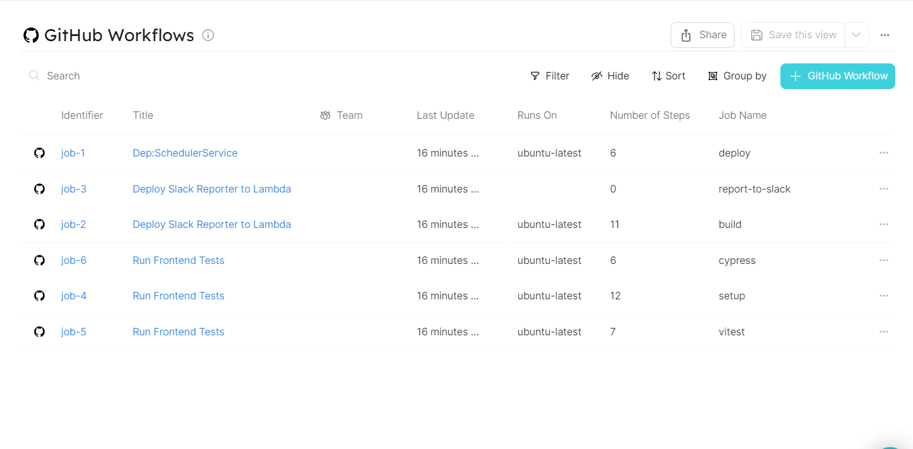

# Ingesting GitHub Workflow

## Getting started

In this example you will create a blueprint for `githubWorkflow` entity that ingests all workflows in a GitHub project using a combination of REST API and Webhook. You will then add some script to transform your workflow yaml files into a format required by the webhook. 

## Workflow Blueprint
Create the workflow blueprint in Port [using this json file](./resources/workflow.md)

## Workflow Webhook Configuration
Use the [webhook configuration file](./resources/github_workflow_webhook_config.md) to create your Port webhook. 

Follow the example guide on how to [create a Port webhook](https://docs.getport.io/build-your-software-catalog/sync-data-to-catalog/webhook/#configuring-webhook-endpoints). You will then use the webhook URL to ingest data to Port via REST API.

### Github CI/CD Variables
To interact with Port using Github Action, you will first need to define your Port credentials [as variables for your workflow](https://docs.github.com/en/actions/learn-github-actions/variables). Then, pass the defined variables to your ci pipeline script.

The list of the required variables to run this pipeline are:
- `WEBHOOK_URL` 

### Workflow Entity Created

